# Qt classes
## Layouts
### QVBoxLayout

### QHBoxLayout
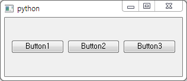
### QGridLayout
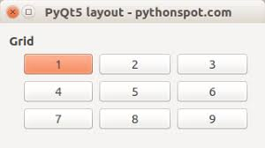
### Size policies

***
## Buttons
### QPushButton
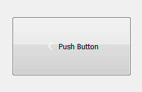
### QRadioButton
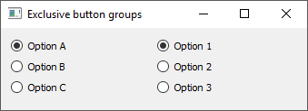
### QCheckBox
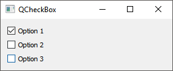
***
## Lists/Inputs
### QComboBox
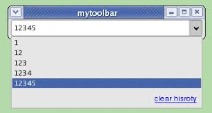
### QLineEdit
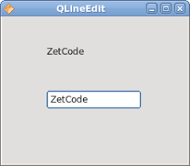
### QTextEdit
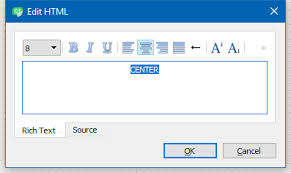
### QListWidget
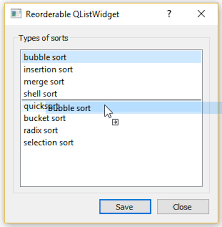
***
## Dialogs
### QMessageBox
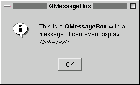
### QDialog
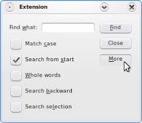
### QDialogBoxButton
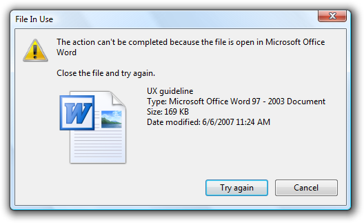
### QFileDialog
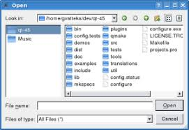
### QFontDialog
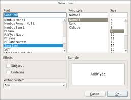
### QColorDialog
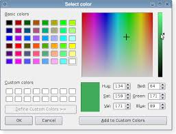
### QInputDialog
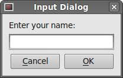
***
## General
### QLabel
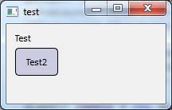
### QGroupBox
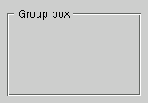
### QTabWidget
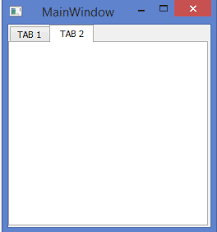
